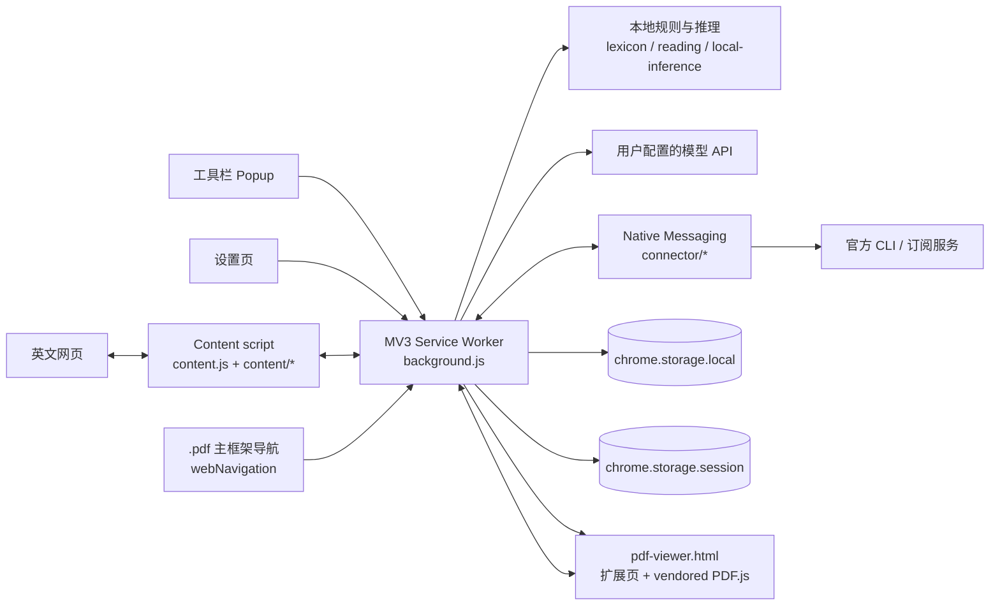

# 架构概览

本文描述当前仓库的运行时边界和改动入口。它不是逐文件 API 文档；具体行为仍以代码和测试为准。

## 运行时结构

## 主要边界

### `extension/background.js`

Service worker 是请求编排和持久状态入口：设置、权限、模型调用、路由、诊断、阅读记录、会话、复习和消息分发在这里汇合。不要继续把可独立测试的规则堆进该文件；稳定规则应放入专门模块，由 background 负责协调。

### `extension/content.js` 与 `extension/content/`

运行在网页主框架中，负责识别阅读区域、渲染词注和卡片、选区操作、复制、复习及页面内状态。这里直接面对不可信且持续变化的宿主 DOM：选择器必须保守，插入物必须可逆，输入区、代码和交互控件必须排除。
content/reader.js 在当前主框架中做有上限的本地正文筛选和白名单 DOM 重建，保留临时源节点映射；content.js 以单一 active surface 在原页与手动 popover 间切换。视图内查词键单击是明确求助，即使本页自动辅助未开启也可使用，不启动被动扫描；结果仍仅作用于活表面。原页双语会在进入前停止发送新请求，已译内容与会话暂存于原页，退出后恢复为停止态，可继续或清除；读者视图翻译与原页会话隔离，按阅读位置发送快照正文。切换、导航、源正文消失和失效请求时清理当前表面辅助。不新增权限、服务商或持久设置。读者视图不搬动宿主节点，退出归还焦点、滚动和它修改的 inert/overflow。详见 ADR 0002。

### `extension/ui/`

`popup.html`/`popup.js` 负责当前标签页的短操作；`options.html`/`options.js` 负责持久配置和说明；服务目录、历史等复杂区域使用独立模块。UI 使用 `extension/design.js` 注入的共享 token，规则见 `docs/design-system.md`。

### `extension/pdf-viewer.*` 与 `extension/pdf-blocks.mjs`

扩展自有的 PDF 阅读表面。`background.js` 通过 `webNavigation.onBeforeNavigate` 拦截主框架 `.pdf` 导航并重定向到 `pdf-viewer.html?src=<原文档地址>`；`#relyless-native` 与 `pdfReader` 设置是回到浏览器原生查看器的出口。阅读器加载 `extension/vendor/pdfjs/` 内的本地 PDF.js（无远程脚本），画布负责视觉排版，文本层按 `pdf-blocks.mjs` 的几何规则聚合成可译文本块。查词、选段翻译、整页翻译复用 `ASSIST`/`PASSAGE_TRANSLATE`/`EMERGENCY_*` 既有契约——后台把 viewer 标签页视作文档表面，文档身份取自 `src` 参数而非扩展页 URL（扩展页对 `chrome.tabs` 不暴露 `url`，身份回落到 `sender.url`）。阅读器不新增持久化、不自动翻译；远程文档仅在站点拒绝跨域读取时经用户点击申请该站访问权限。详见 ADR 0005。

### 领域与阅读模块

- `shared.js`：默认设置、规范化和共享常量。
- `reading.js`、`personalization.mjs`、`srs.js`：阅读证据、支持偏好和复习调度。
- `lexicon.js`、`gloss.mjs`、`sentence-groups.mjs`：本地词汇分析、模型契约和结构化结果。
- `domain-routing.js`、`local-classifier.js`、`local-inference/`：领域识别与本地模型运行。
- `history-service.js`、`conversation-store.js`、`conversation-memory.js`：明确授权后的阅读和对话记录。

这些模块应保持无 DOM 或少 DOM、输入输出可规范化，并由测试直接覆盖。

### 模型服务边界

- `api-providers.mjs`：服务商定义和规范化。
- `api-transport.mjs`：HTTP 请求与响应处理。
- `api-key-pool.js`、`api-key-rotation.js`：多密钥状态和切换。
- `routing.js`：可选模型路由判定。
- `subscription.js`：订阅连接器协议。
- `connector/`：Native Messaging 主机及官方 CLI 适配。

服务商差异应停留在这些边界内。阅读和 UI 模块不应直接拼接特定服务商请求。

### 构建与验证

- `tests/`：Bun 测试，覆盖领域规则、消息契约、存储、连接器和 UI 控制器。
- `tools/package-release.mjs`：从干净、已提交的 HEAD 生成 Release 包和校验和。
- `docs/verification-checklist.md`：无法由当前自动化可靠覆盖的浏览器冒烟场景。

## 数据生命周期

| 数据 | 首选位置 | 约束 |
| --- | --- | --- |
| 设置、网站规则、用户明确保留的词档案 | `chrome.storage.local` | 有 schema、迁移、导出/清理路径 |
| 页面会话、模型缓存、临时意图 | `chrome.storage.session` 或内存 | 浏览器会话结束即失效；限制数量和寿命 |
| 无痕窗口上下文 | 内存/会话 | 不写入普通窗口持久记录 |
| API Key 和连接配置 | 扩展本机存储 | 不写日志、不进入诊断导出、错误脱敏 |
| 页面正文与 URL | 默认不持久化 | 只为明确任务发送最小必要内容 |

## 常见改动从哪里开始

| 改动 | 首先阅读 |
| --- | --- |
| 新增阅读提示或交互 | `content.js`、`content/`、`reading.js`、设计系统 |
| 修改设置或默认值 | `shared.js`、`options.js`、相关存储迁移 |
| 新增模型服务 | `api-providers.mjs`、`api-transport.mjs`、服务目录测试 |
| 修改订阅连接器 | `subscription.js`、`connector/`、协议与生命周期测试 |
| 修改领域识别 | `domain-routing.js`、`local-classifier.js`、`local-inference/` |
| 修改记录或个性化 | `history-service.js`、`personalization.mjs`、隐私文档 |
| 修改 UI 视觉 | `design.js`、`ui.css`、`docs/design-system.md` |
| 修改权限或可访问资源 | `manifest.json`、`activation.js`、隐私与安全说明 |
| 修改 PDF 阅读器 | `pdf-viewer.*`、`pdf-blocks.mjs`、`background.js`（导航拦截与 `readingSource`）、ADR 0005 |
| 发布版本 | `package.json`、`manifest.json`、README、Release 工具 |

## 架构变更门槛

以下改动应先写 ADR：

- 新增浏览器权限、持久数据类别或远程数据接收方；
- 改变 content script、service worker、offscreen 或 connector 的职责边界；
- 改变存储 schema、迁移策略或扩展身份；
- 引入新的运行时依赖、远程脚本或构建链；
- 改变默认自动行为、失败回落或模型路由原则。
