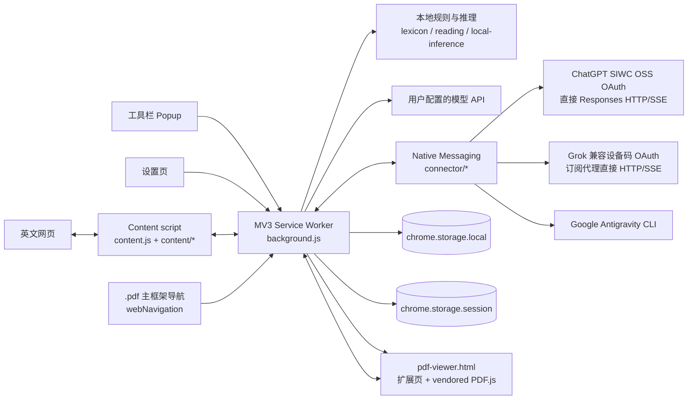

# 架构概览

本文描述当前仓库的运行时边界和改动入口。它不是逐文件 API 文档；具体行为仍以代码和测试为准。

## 运行时结构

```mermaid
flowchart LR
  Page[英文网页] <--> Content[Content script\ncontent.js + content/*]
  Popup[工具栏 Popup] --> BG[MV3 Service Worker\nbackground.js]
  Options[设置页] --> BG
  Content <--> BG
  BG --> Local[本地规则与推理\nlexicon / reading / local-inference]
  BG --> API[用户配置的模型 API]
  BG <--> Native[Native Messaging\nconnector/*]
  Native --> SIWC[ChatGPT SIWC OSS OAuth\n直接 Responses HTTP/SSE]
  Native --> Grok[Grok 兼容设备码 OAuth\n订阅代理直接 HTTP/SSE]
  Native --> CLI[Google Antigravity CLI]
  BG --> LocalStore[(chrome.storage.local)]
  BG --> SessionStore[(chrome.storage.session)]
  PdfNav[.pdf 主框架导航\nwebNavigation] --> BG
  BG --> PdfViewer[pdf-viewer.html\n扩展页 + vendored PDF.js]
  PdfViewer <--> BG
```

## 主要边界

### `extension/background.js`

Service worker 是请求编排和持久状态入口：设置、权限、模型调用、路由、诊断、阅读记录、会话、复习和消息分发在这里汇合。不要继续把可独立测试的规则堆进该文件；稳定规则应放入专门模块，由 background 负责协调。
`activation.js` 承载自动开启规则与域名关键词提示：弹窗提示在打开时本机比较当前域名，图标提示由用户开启后才观察主框架导航；两者只按域名片段比较 hostname，不产生权限来源或网址持久化（见 ADR 0006）。

### `extension/content.js` 与 `extension/content/`

运行在网页主框架中，负责识别阅读区域、渲染词注和卡片、选区操作、复制、复习及页面内状态。这里直接面对不可信且持续变化的宿主 DOM：选择器必须保守，插入物必须可逆，输入区、代码和交互控件必须排除。
content/reader.js 在当前主框架中做有上限的本地正文筛选和白名单 DOM 重建，保留临时源节点映射；content.js 以单一 active surface 在原页与手动 popover 间切换。视图内查词键单击是明确求助，即使本页自动辅助未开启也可使用，不启动被动扫描；结果仍仅作用于活表面。原页双语会在进入前停止发送新请求，已译内容与会话暂存于原页，退出后恢复为停止态，可继续或清除；读者视图翻译与原页会话隔离，按阅读位置发送快照正文。切换、导航、源正文消失和失效请求时清理当前表面辅助。不新增权限、服务商或持久设置。读者视图不搬动宿主节点，退出归还焦点、滚动和它修改的 inert/overflow。详见 ADR 0002。
读者快照直接重建选中正文的子节点（嵌套 main/article 作为块级 section），避免把整篇文章包进内联容器。手动确认的本页翻译在前台最多同时发送两个各自有界的段落批次，实际并发还受用户设置的请求上限约束；单个批次仍遵守 4 段、4000 字符的边界。按阅读位置排序，停止、切换视图和源正文变化时取消失效批次并丢弃迟到结果；真实服务商耗时仍取决于模型和网络。
快照只保留可读名称的链接；无名称链接与空表头保留结构但降级语义，原页节点不受影响。视图内部的页内锚点由本地滚动和聚焦处理，不改变宿主 URL 与文档身份。
并发批次中有一批失败时，先等待已在途的另一批完成并保留其已验证译文，再停止后续派发；不能把另一批的成功结果当作失败丢弃。
### `extension/ui/`

`popup.html`/`popup.js` 负责当前标签页的短操作；`options.html`/`options.js` 负责持久配置和说明；服务目录、历史等复杂区域使用独立模块。UI 使用 `extension/design.js` 注入的共享 token，规则见 `docs/design-system.md`。

### `extension/pdf-viewer.*` 与 `extension/pdf-blocks.mjs`

扩展自有的 PDF 阅读表面。默认仍由浏览器原生查看器接管 .pdf 导航；进入路径有两条且都源于用户明确动作：`.pdf` 链接右键菜单「在阅读器中打开 PDF」单次进入，或 `pdfReader` 设置开启后 `webNavigation.onBeforeNavigate` 拦截主框架 `.pdf` 导航并重定向到 `pdf-viewer.html?src=<原文档地址>`。`#relyless-native` 是「在原生查看器打开」的单次逃逸标记。阅读器加载 `extension/vendor/pdfjs/` 内的本地 PDF.js（无远程脚本），画布负责视觉排版，文本层按 `pdf-blocks.mjs` 的几何规则聚合成可译文本块；渲染按代次（renderGen）失效，缩放会取消在途任务。查词、选段翻译、整页翻译复用 `ASSIST`/`PASSAGE_TRANSLATE`/`EMERGENCY_*` 既有契约——后台把 viewer 标签页视作文档表面，文档身份取自 `src` 参数而非扩展页 URL（扩展页对 `chrome.tabs` 不暴露 `url`，身份回落到 `sender.url`）。阅读器不新增持久化、不自动翻译；远程文档仅在站点拒绝跨域读取时经用户点击申请该站访问权限。详见 ADR 0005。

### 领域与阅读模块

- `shared.js`：默认设置、规范化和共享常量。
- `reading.js`、`personalization.mjs`、`srs.js`：阅读证据、支持偏好和复习调度。
- `lexicon.js`、`gloss.mjs`、`sentence-groups.mjs`：本地词汇分析、模型契约和结构化结果。
- `domain-routing.js`、`local-classifier.js`、`local-inference/`：领域识别与本地模型运行。
- `history-service.js`、`conversation-store.js`、`conversation-memory.js`：明确授权后的阅读和对话记录。

这些模块应保持无 DOM 或少 DOM、输入输出可规范化，并由测试直接覆盖。

### 模型服务边界

- `api-providers.mjs`：服务商定义和规范化。
- `api-transport.mjs`：HTTP 请求与响应处理。
- `api-key-pool.js`、`api-key-rotation.js`：多密钥状态和切换。
- `routing.js`：可选模型路由判定。
- `subscription.js`：订阅连接器协议。
- `connector/host.mjs`：Node.js Native Messaging 主机，验证扩展消息并管理请求生命周期；不向浏览器返回 OAuth 凭证。
- `connector/siwc.mjs`：ChatGPT 官方 SIWC 开源 OAuth 登录、账户与凭证管理、模型列表、直接 Responses HTTP/SSE 及有界会话历史；不依赖 Codex CLI。
- `connector/grok.mjs`：Grok 兼容 device code OAuth、OIDC 验证、Native 凭证管理与订阅代理 HTTP/SSE 直连；不依赖 Grok CLI。
- `connector/antigravity.mjs`：保留现有 Google CLI 适配与用户配置；官方第三方访问限制见下文。

服务商差异应停留在这些边界内。阅读和 UI 模块不应直接拼接特定服务商请求。

#### ChatGPT 订阅通道

用户授权的是符合 SIWC 资格的 ChatGPT Plus/Pro 计划，不是浏览器内保存的 API Key。主机启动临时 loopback 监听器，用每次登录独立的 state、nonce 与 PKCE S256 完成官方 OAuth 流程；在主机验证回调和 ID token 后保留注册身份及凭证，浏览器只获得登录地址、脱敏账户状态和模型信息。OAuth 访问/刷新令牌只在主机持有，既不走扩展消息，也不写入扩展存储、诊断或导出。旧 Codex 凭证不导入，升级需重新安装主机并登录；不保留 CLI 兼容路径。

主机向 `https://api.openai.com/v1/models` 查询目录，并以 `Authorization: Bearer <OAuth access token>` 直接请求 `https://api.openai.com/v1/responses`。模型目录不代表保证可用；实际权限、额度和同意状态决定推理能否完成。HTTP 推理固定 `store:false`、`stream:true`，逐条消费 SSE，只有 `response.completed` 确认成功；失败、incomplete 或提前断流如实报告，不提交未完成的结构化结果。

SIWC HTTP 预览不支持 `previous_response_id` 或 `conversation`；每轮 `input` 数组带当前任务与所需有界历史，不依赖远端持久会话。主机内的临时历史与扩展本机最多 30 天的追问记录是两层不同生命周期；主机重启后，继续追问须从扩展提供的有限历史重建。请求不发送此流程不支持的 `temperature`、`max_output_tokens` 等 API 参数，也不把 SIWC 扩为音视频或完整代理工具接口。协议、隐私与迁移依据见 [ADR 0007](decisions/0007-chatgpt-siwc-native-host.md)。

#### Grok 兼容直连通道

用户明确接受复用官方 Grok CLI 公开 OAuth client ID 的兼容方案：它不是 RelyLess 自有客户端注册，也不保证 xAI 官方第三方支持。主机使用 `https://auth.x.ai/oauth2/device/code` 和 `/oauth2/token` 完成设备码授权与轮询，申请 `openid profile email offline_access grok-cli:access api:access`，不申请会话读写权限或新增 Grok 追问能力。核实官方 userinfo 身份并检查必要授权范围后，才接受登录；返回 ID token 时，先以官方 JWKS 校验 ES256 签名、issuer、audience、subject 与有效期，再核对 userinfo subject。浏览器只获得可信验证地址、短用户码、脱敏账户状态与模型，不获得 device code、ID/access/refresh token。取消、拒绝、过期或身份验证失败不能显示就绪。

Native 主机在 `grok-oauth.json` 独占持有访问/轮换刷新令牌和账户记录；POSIX 0600，原子替换刷新记录，不进入扩展存储、诊断或导出。不安装、查找或执行 Grok CLI，不把请求正文写为提示词文件；不导入旧 CLI 凭证，旧安装数据保留且不读取、不删除。从旧 CLI 通道迁移时，先重新安装主机，再发起新的设备码登录；后续主机更新保留有效的直连授权。退出先清除本机授权，并尝试远端 `/oauth2/revoke`；远端失败如实返回，不能阻止本机退出或冒充成功撤销。

账户身份来自 `https://auth.x.ai/oauth2/userinfo`；若服务返回 ID token，先校验其 ES256 签名及 claims，再与 userinfo subject 核对。模型目录 `/models-v2` 与推理 `/responses` 位于 `https://cli-chat-proxy.grok.com/v1`。只暴露适用的 Responses 模型，不把隐藏/API-key-only 项当作订阅权益。请求标识、版本与 User-Agent 如实标识 RelyLess；`X-XAI-Token-Auth: xai-grok-cli` 是兼容的令牌认证方案，不是冒充 CLI 来源。请求 `store:false`，但 xAI 仍接收账户、所需文本和正常网络元数据，正常保留依服务商政策；不承诺零保留。HTTP/SSE 必须明确完成，失败/incomplete/断流或无效结构化结果不算成功。认证、权益/套餐、额度和权限失败如实报告；不新增自动推理重试或 API Key 消费回退。现有用户显式配置的路由与故障转移边界不变。

ChatGPT SIWC 不变；Google 保留现有 Antigravity CLI 和用户配置，不迁移、不删除。[Antigravity 官方 FAQ](https://antigravity.google/docs/faq/) 警告第三方访问违反其服务条款且可能导致账户暂停或终止；保留通道不是官方支持声明。来源、风险和退出条件见 [ADR 0008](decisions/0008-grok-oauth-direct.md)。

### 构建与验证

- `tests/`：Bun 测试，覆盖领域规则、消息契约、存储、连接器和 UI 控制器。
- `tools/package-release.mjs`：从干净、已提交的 HEAD 生成 Release 包和校验和。
- `docs/verification-checklist.md`：无法由当前自动化可靠覆盖的浏览器冒烟场景。

## 数据生命周期

| 数据 | 首选位置 | 约束 |
| --- | --- | --- |
| 设置、网站规则、用户明确保留的词档案 | `chrome.storage.local` | 有 schema、迁移、导出/清理路径 |
| 页面会话、模型缓存、临时意图 | `chrome.storage.session` 或内存 | 浏览器会话结束即失效；限制数量和寿命 |
| 无痕窗口上下文 | 内存/会话 | 不写入普通窗口持久记录 |
| API Key 和连接配置 | 扩展本机存储 | 不写日志、不进入诊断导出、错误脱敏 |
| 页面正文与 URL | 默认不持久化 | 只为明确任务发送最小必要内容 |
| ChatGPT OAuth 注册信息与访问/刷新令牌 | Native 主机数据目录的 `siwc.json` | POSIX 0600；不进入浏览器；不复用 Codex 凭证；退出登录清除账户令牌，保留可复用注册信息 |
| ChatGPT 当前推理会话历史 | Native 主机有界内存 | 闲置 30 分钟失效、最多 50 会话/每会话 12 组问答；退出登录、切换账户或主机退出清除 |
| Grok OAuth 访问/轮换刷新令牌与账户记录 | Native 主机数据目录的 `grok-oauth.json` | POSIX 0600；原子刷新；不进入浏览器；不导入旧 CLI 凭证；退出清本机授权并尝试远端撤销 |
| 主动追问记录 | 扩展本机 IndexedDB | 最多 30 天、每会话 40 轮；无痕不落盘；继续追问只取有限已完成回合 |

## 常见改动从哪里开始

| 改动 | 首先阅读 |
| --- | --- |
| 新增阅读提示或交互 | `content.js`、`content/`、`reading.js`、设计系统 |
| 修改设置或默认值 | `shared.js`、`options.js`、相关存储迁移 |
| 新增模型服务 | `api-providers.mjs`、`api-transport.mjs`、服务目录测试 |
| 修改订阅连接器 | `subscription.js`、`connector/`、协议与生命周期测试 |
| 修改领域识别 | `domain-routing.js`、`local-classifier.js`、`local-inference/` |
| 修改记录或个性化 | `history-service.js`、`personalization.mjs`、隐私文档 |
| 修改 UI 视觉 | `design.js`、`ui.css`、`docs/design-system.md` |
| 修改权限或可访问资源 | `manifest.json`、`activation.js`、隐私与安全说明 |
| 修改 PDF 阅读器 | `pdf-viewer.*`、`pdf-blocks.mjs`、`background.js`（导航拦截与 `readingSource`）、ADR 0005 |
| 发布版本 | `package.json`、`manifest.json`、README、Release 工具 |

## 架构变更门槛

以下改动应先写 ADR：

- 新增浏览器权限、持久数据类别或远程数据接收方；
- 改变 content script、service worker、offscreen 或 connector 的职责边界；
- 改变存储 schema、迁移策略或扩展身份；
- 引入新的运行时依赖、远程脚本或构建链；
- 改变默认自动行为、失败回落或模型路由原则。
