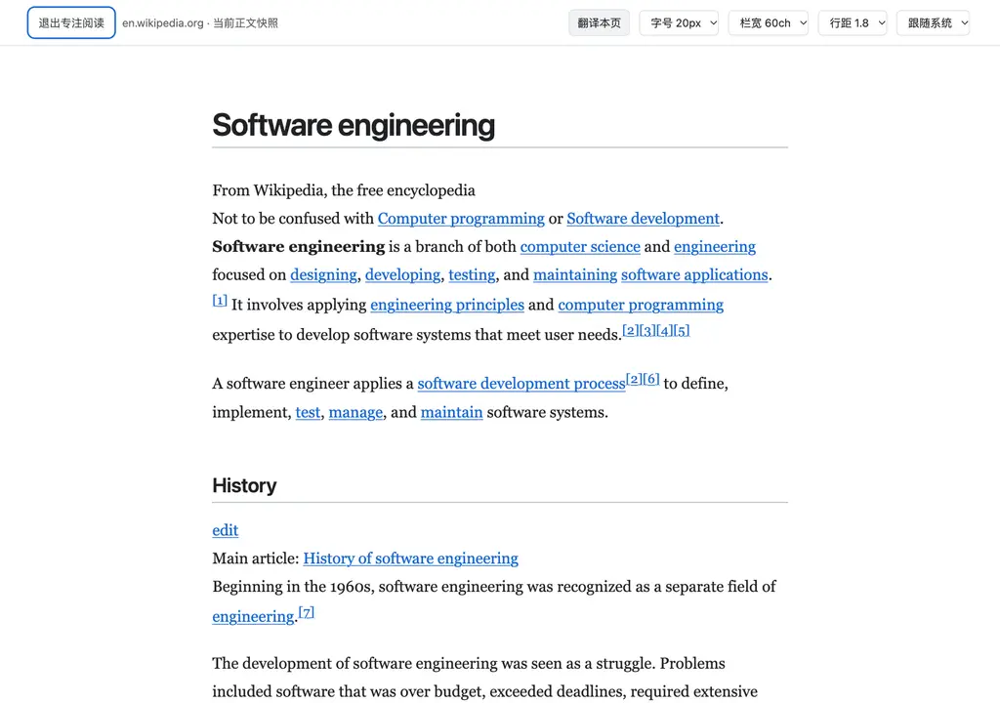
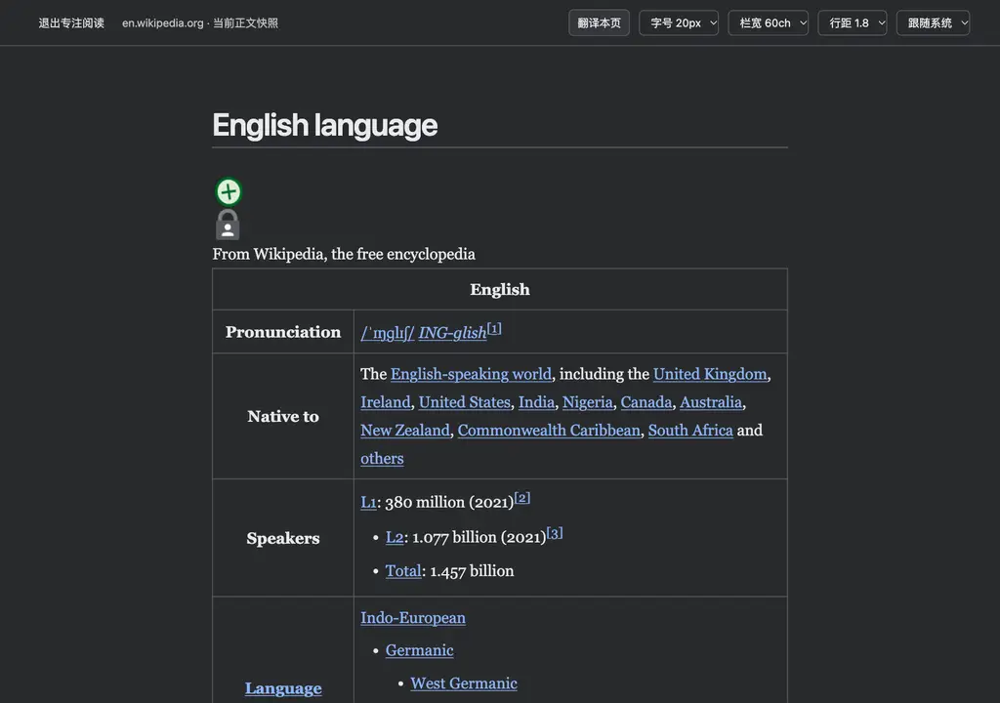

# 开发记录：专注阅读正文表面

- 日期：2026-09-24
- 状态：已交付
- 相关 Issue：https://github.com/rockythink/relyless/issues/23、https://github.com/rockythink/relyless/issues/44
- 相关 PR：#45（长文修正）
- 相关 ADR：../decisions/0002-focused-reader-surface.md

## 背景与目标

读者需要主动排除网页布局干扰，同时保留真实原文和可逆的原页。弹窗加入独立入口；提取不可靠时拒绝，不以模型猜测补全。开启不依赖模型配置或网站自动辅助开关。

## 非目标

不做远程提取、自动全文翻译、跨页保存、媒体重建、站点通用的完整 CSS 隔离或正文编辑同步。

## 实现边界

内容脚本在当前文档有界识别正文，以安全元素/属性白名单重建临时快照，手动 popover 承载并隔离原页。原页节点不搬动；active surface 切换时清除旧辅助、终止迟到操作，当前表面的卡片/标注/选段操作沿用现有规则。读者正文按查词键单击无需先开启全页辅助，但不会启动自动分析；原页双语进入视图时停止新请求并保留译文，退出恢复停止态，可继续或清除；读者译文与原页隔离。顶部显式翻译按钮经估算与预算确认后复用正文双语翻译，只处理读到附近的快照正文。自动提示失败改为短时、非阻断状态，详情保留底层错误；读者正文的「我已认识」覆写宿主 button 样式。导航、源正文消失、退出和禁用回到原页。弹窗发送受信任的当前页命令，service worker 沿用已有脚本注入路径；词汇模块静态导入以兼容 ServiceWorkerGlobalScope。

## 数据、权限与费用

不新增权限、持久存储或远程端点；排版选择仅本次视图。进入本身不产生模型请求；读者即使未开启本页自动辅助，按键单击英文词仍明确请求有限词句与上下文，且不会开启被动处理。主动翻译在当前快照上按原有上限发送正文片段与有限上下文，可能计费；停止或退出不能撤回已发送的请求，原页既有译文不会被视图的「返回原文」清除。快照仅存在于当前页内存，未加载图片/媒体回原页；原图可能产生资源请求。

## 风险与回滚

复杂网页可能误选正文、遗漏嵌入内容，或宿主后续修改使快照过时；拒绝歧义和超限、明确回原页，退出再进入重新提取。手动 popover 与宿主 CSS/焦点交互仍需跨站点核验。可回退弹窗入口、注入文件与内容脚本的 reader 分支；无数据迁移。

## 验证证据

- `bun test tests/content-reader-lifecycle.test.js`：1 通过、27 断言；原页结果在视图切换、局部清理和 `SS_REFRESH` 后保留同一译文节点，新 token 可继续，显式清除移除结果。并覆盖视图容器被宿主移除后原页 inert/滚动锁恢复；异步译文测试等待可观察结果而不是固定延时；既有读者/后台专项检查同样覆盖费用确认、译文清理和预算估算。
- `npm ci` 成功；`npm run check`：452 通过、0 失败、2417 断言；`git diff --check` 无问题。
- Chromium 本地英中 fixture：手动 popover、主题/字号/栏宽/行距、375px 宽度、320px/2x、Escape 恢复、无横向溢出；真实英语和中文维基百科页面提取成功，英语页渲染了 43,407 字符并未包含脚本、iframe、表单或 onclick 属性。英文真实站点包含少量正文容器前的状态标识，站点特有排版噪声仍是残余风险。
- 本地 Chromium 内容脚本模拟消息桥：导航 D+单击译文直接出现在链接旁；读者先估算再确认并翻译邻近正文。「本页辅助未开启」状态下 D+单击正文真实指针事件发送一次 ASSIST，持续按键超过 350ms 也出现已确认解释卡，无自动请求。原页已翻译 4 段后进入读者视图，原结果留存；视图翻译后「返回原文」只清视图，退出后原页 4 段译文仍在。模拟响应不代表真实服务商结果。另用宿主 article button{display:none!important} 验证「我已认识」徽标仍可见，13px、28px 高且悬于原文上方。
- 同一 Chromium fixture 中，原页与专注阅读先后对同一 `reading` 发送 D+单击，两个 `ASSIST` 请求的词、82 字符语境及空 `articleKey` 完全相同；既有后台会话缓存按标签页、提供方、设置与请求身份命中，同一请求无需再调用模型（`tests/background-explanation.test.js` 覆盖重复求助）。不同语境或语言仍需重新确认。徽标从原词右上方偏移改为从词起点向上 2px，明暗视图均用真实浏览器截图检查，点击命中徽标。模拟消息响应不证明真实服务费用。
- 全新启动的真实未打包 Chrome 扩展：从实际 popup 进入/退出无服务的专注阅读，原文可读；关闭本页辅助后仍能进入视图，点击「翻译本页」只显示用量估算与二次确认，不提前发送模型请求；视图容器被宿主移除后原页 inert 和滚动锁恢复。当前测试浏览器将文章标签置于 hidden，不能把该环境中的 D+单击当作真实模型链路验收。另有带固定定位宿主 p 规则的 Chromium 页面，快照段落恢复 static/block，5,000 段、25 万字符提取耗时约 74ms。
### 后续修正：长文翻译响应

原快照把选中的 article 包在单个 span 里，导致专注阅读的整篇正文成为一个大文本单元；原页和视图的翻译调度也串行等待每批返回。现在保持快照正文的段落结构，附近最多两个有界批次并行处理（仍受设置中的请求并发上限约束），失效批次按序取消，迟到结果不落入新表面。模型调用总量随可见段落切分变化，不保证少于原先的大块请求。

- 回归：`bun test tests/content-reader-lifecycle.test.js` 在修复前因两个批次不能同时在途而失败，修复后 1 通过、30 断言；第二批等待时第一批的中文可先显示。`npm run check`：452 通过、0 失败、2420 断言。
- Chromium 本地长文章模拟 250ms 响应：原页首两个请求各 4 段、2161/2848 字符，几乎同时开始；专注阅读首两个请求各 4/3 段、2161/2136 字符，同刻开始，快照正文为 H1、P、P… 而非单个 span；可视段落译文分别嵌入原文旁。已截图核对深色专注阅读。此模拟不能代表真实服务商的延迟。
- 并发失败复核：先让两批同时在途，再让第一批返回错误、第二批成功。修复前第二批译文丢失；修复后已验证的第二批保留，后续派发停止并报告错误。当前 `npm run check` 在本分支为 517 通过、0 失败。真实 Chrome for Testing（仅在隔离浏览器中临时授予两个阅读站点权限，最终 manifest 无变更）打开维基百科 Software engineering 浅色页及 English language 站点原生深色页：读者均有独立段落和本机衬线字体、无横向溢出，退出后原页节点身份与可交互状态恢复；375px/2x 浅色视图仍可操作。无服务时二次点击翻译前显示约 11411 token 估算，服务失败没有伪造译文。真实服务耗时与译文质量未验证。

实际扩展截图（无模型生成结果；浅色／深色站点分别取自公开维基百科文章）：

截图中的维基百科文本由其贡献者按 CC BY-SA 4.0 提供；来源与许可见根目录 NOTICE。

### 后续修正：快照链接与表头可访问性（Issue #46）

真实 Wikipedia English language 中，有些脚注回链的文本后代被站点设为 display:none，浏览器只用 CSS counter 伪内容显示回链；快照过滤隐藏后代后产生无名称链接。另有真正为空的表头。修复前视图审计报告 377 个无名称链接与 4 个空表头；修复后浅色 Software engineering 与深色 English language 的视图范围内 axe 均 0 confirmed violations（分别仍有 1、2 项需人工复核）。无名锚点保留安全 ID 但不再可交互，空表头变为普通单元格；可读的正文链接与脚注仍保留。键盘 Enter 激活具名脚注时视图保持开启、焦点和滚动进入快照目标，原页面 URL 不变；退出后原文节点仍在，滚动锁解除。截图已替换为本轮实际扩展画面。
## 后续事项

后续在更多真实网站复核复杂 CSS 和延迟媒体；未配置真实服务商凭证，不声称远程模型调用已验收。
